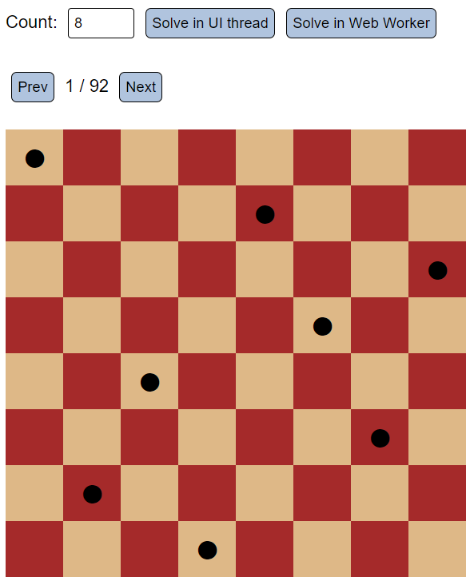

# Angular 8 Demo

Shows some new features in Angular 8.

## Queens Problem

The implementation of the queens problem shows how we can execute intense calulations in the background using web worker.

To test it, request a solution for the 12x12 queens problem using the main thread and also using web workers. You'll see that in the first case the UI freezes while in the second case one can interact with it during the calcuation.

## 4 Steps to your web worker in Angular 8

- Generate a component: ``ng g c my-calc``
- In the same directory, generate a worker with the same name: ``ng g worker my-calc``
  - This gives you a worker script and some code within the component to call the worker
- Update the worker script to your needs
- Update the code for calling the worker to your needs
